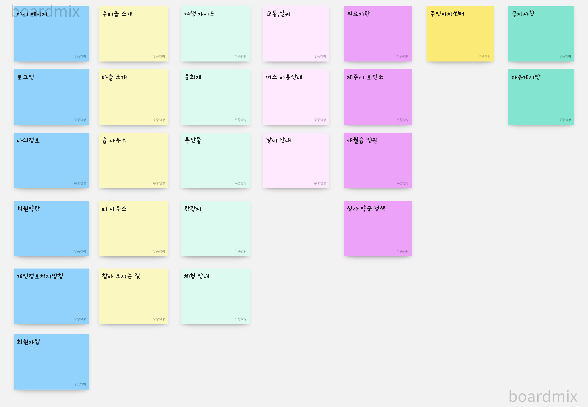
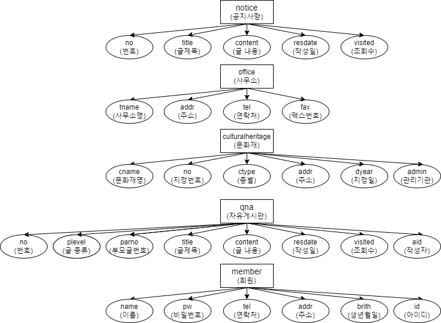
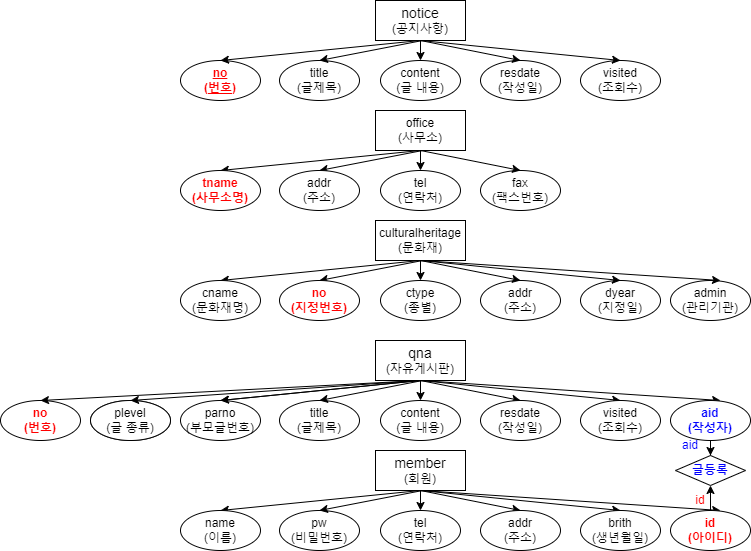
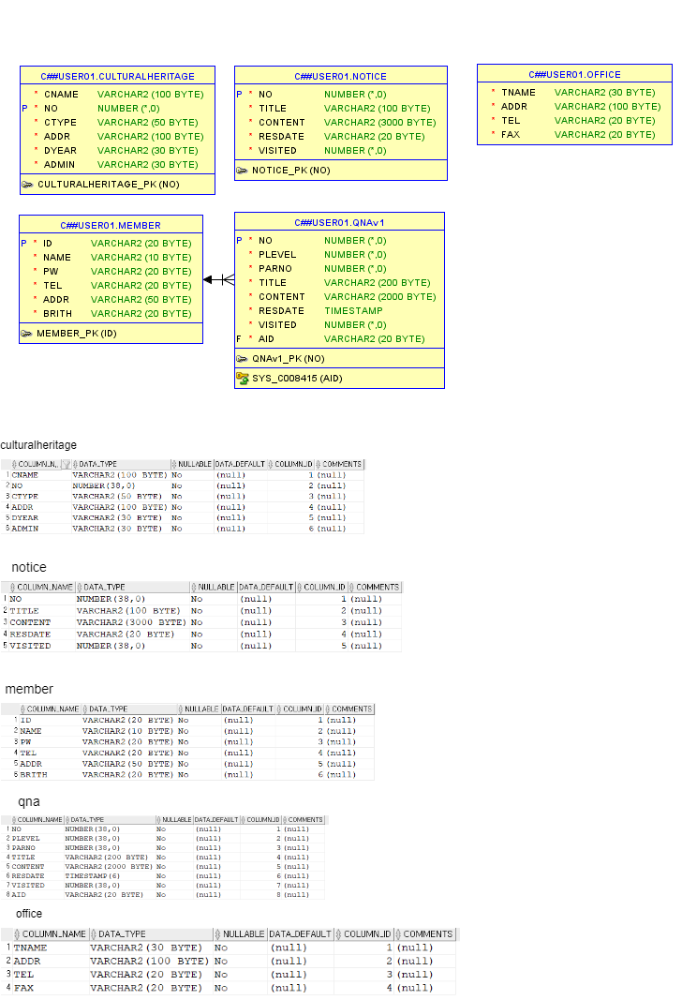

# 프로젝트 개발 보고서(Project Development Report) 
--------------------------------------------------------------
## 1. 프로젝트 개요 (Project Outline)
   - dfd
   - dfdfdsf
   - sdfsdf
   - 

   

## 2. 포로젝트의 목적(Project Purpose)
    dsdsfsdfsdf
    dfsdfsdf

   

## 3. 프로젝트 개발 환경 정보(Project Dvelopement Environment)
    - Project Topic : Gasan-dong Intro Web Application
    - Develope Environment; Open JDK 11
    - Language : Java 11
    - Web Module : Jsp/Servlet 3.0
    - Process Pattern : MVC Pattern
    - Database System(DBMS) : Oracle 21C XE
    - Database Design : SQL Developer 23.1.1
    - Entity Relationship Design : draw.io 20.8.16
    - Java Database Connector : ojdbc11
    - Application Design : Object aid 1.2.4
    - Back Template Language : Java/Servlet 11
    - Front Template Language : Jsp(1STL/EL) 3.0/HTML5/CSS3/Javascript ES5
    - Web (Application) Server : Tomcat 9.0
    - Navigation Design : WordCloud 3.7, Card Sort BoardMix

   

## 4. 프로젝트 기획 및 설계(Project Planning & Design)

### 4-1. 네비게이션 설계(Navigation Design)

| 마이페이지 | 우리읍 소개 | 여행 가이드 | 교통,날씨     | 의료기관     | 주민자치센터 | 공지사항   |
|-----------|------------|------------|--------------|--------------|-------------|-----------|
| 로그인    |  마을 소개  | 문화재      | 버스 이용안내 | 제주시 보건소 |             | 자유게시판 |
| 나의정보  |  읍 사무소  | 특산물      | 날씨 안내     | 애월읍 병원   |             |           |
| 회원약관  |  리 사무소  | 관광지      |    &nbsp;          | 심약 약국 검색 |   &nbsp;   |  &nbsp; |
| 개인정보처리방침 | 찾아 오시는 길 | 체험 안내 |  &nbsp; | &nbsp;   | &nbsp;   | &nbsp;   |       
| 회원가입  | &nbsp;   | &nbsp;  | &nbsp;  | &nbsp;   | &nbsp;   | &nbsp;   |

#### 4-1.1 자료 수집

#### 4-1.2 콘텐츠 분류

#### 4-1.3 서비스 흐름 설계

#### 4-1.4 서비스 시나리오
**회원 비회원 시나리오**

**관리자 시나리오**

### 4-2. 데이터베이스 설계(Database Design)

#### 4-2-1. 개념적 설계

#### 4-2-2. 논리적 설계

#### 4-2-3. 물리적 설계
