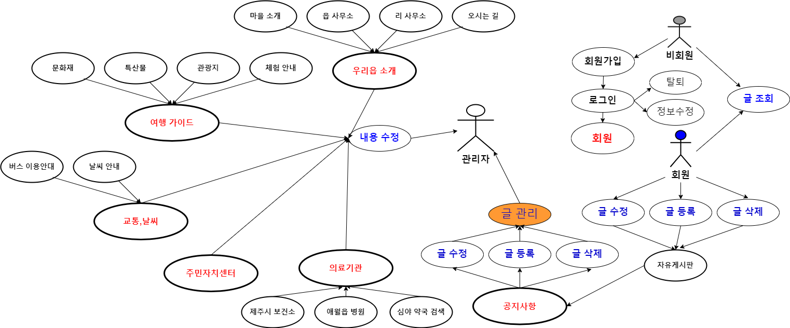

# 프로젝트 개발 보고서(Project Development Report) 
--------------------------------------------------------------
## 1. 프로젝트 개요 (Project Outline)

    - 제주도 애월읍은 제주도에서도 손꼽는 관광지중 하나로써 애월읍을 소개하기 위한
      웹 애플리케이션을 자바 기반의 웹 애플리케이션으로 개발하게 되었다.
    

   

## 2. 포로젝트의 목적(Project Purpose)
    -애월읍의 유래와 특징, 동네의 각종 기관과 의료시설 정보등과
     자랑스러운 문화재,체험학습,축제,행사 등 애월에서의 시간이 따듯한 시간이 되었으면 하는 바램이다.

   

## 3. 프로젝트 개발 환경 정보(Project Dvelopement Environment)
    - Project Topic : Gasan-dong Intro Web Application
    - Develope Environment; Open JDK 11
    - Language : Java 11
    - Web Module : Jsp/Servlet 3.0
    - Process Pattern : MVC Pattern
    - Database System(DBMS) : Oracle 21C XE
    - Database Design : SQL Developer 23.1.1
    - Entity Relationship Design : draw.io 20.8.16
    - Java Database Connector : ojdbc11
    - Application Design : Object aid 1.2.4
    - Back Template Language : Java/Servlet 11
    - Front Template Language : Jsp(1STL/EL) 3.0/HTML5/CSS3/Javascript ES5
    - Web (Application) Server : Tomcat 9.0
    - Navigation Design : WordCloud 3.7, Card Sort BoardMix

   

## 4. 프로젝트 기획 및 설계(Project Planning & Design)

### 4-1. 네비게이션 설계(Navigation Design)

| 마이페이지 | 우리읍 소개 | 여행 가이드 | 교통,날씨     | 의료기관     | 주민자치센터 | 공지사항   |
|-----------|------------|------------|--------------|--------------|-------------|-----------|
| 로그인    |  마을 소개  | 문화재      | 버스 이용안내 | 제주시 보건소 |             | 자유게시판 |
| 나의정보  |  읍 사무소  | 특산물      | 날씨 안내     | 애월읍 병원   |             |           |
| 회원약관  |  리 사무소  | 관광지      |    &nbsp;          | 심약 약국 검색 |  |  &nbsp; |
| 개인정보처리방침  | 찾아 오시는 길 | 체험 안내 |  &nbsp; | &nbsp;   | &nbsp;   | &nbsp;   |       
| 회원가입  | &nbsp;   | &nbsp;  | &nbsp;  | &nbsp;   | &nbsp;   | &nbsp;   |

#### 4-1.1 자료 수집

#### 4-1.2 콘텐츠 분류

#### 4-1.3 서비스 흐름 설계

#### 4-1.4 서비스 시나리오
**회원 비회원 시나리오**
 
  1. 지역 소개인 지명 유래와 연혁을 탐색한다.
  2. 지역 소개인 지역 특징 및 시설 안내를 탐색한다.
  3. 해당 지역의 지도가 궁금하여 오시는 길을 탐색한다.
  4. 해당 지역의 교통편을 알아보고, 방문을 계획한다.
  5. 사용자는 어디 어디에 방문할지 주요 가볼만한곳과 주요 축제등을 확인한다.
  6. 해당 지역의 이벤트나 특이사항을 확인하기 위하여 공지사항의 글을 확인한다.
  7. 자유게시판에 글을 작성하기 위하여 회원가입이 필요하다.
  8. 회원가입을 시작하게 되면, 회원 약관 및 개인정보처리 방침에 동의하도록 한다.
  9. 회원가입 페이지에서 필수 정보를 입력하고, 아이디의 중복확인 거쳐 회원 가입을 완료하도록 한다.
  10. 회원 가입 후 로그인을 하도록 한다.
  11. 공지사항 글을 확인하고, 해당 정보가 없는 경우 궁금한 사항을 질문하기 위해 묻고 답하기로 이동한다.
  12. 묻고 답하기 페이지에서 궁금한 사항에 대한 답이 있는지 검색한다.
  13. 해당 정보가 있으면, 해당 묻고 답하기 글을 확인하고, 없으면, 질문을 등록하도록 한다.

     
**관리자 시나리오**
 
   1. 관리자로 로그인을 하도록 한다.
   2. 공지사항 목록을 확인하고, 누락된 상세 정보가 있는지 확인한다.
   3. 해당 지역의 이벤트나 특이사항을 공지사항으로 등록하도록 한다.
   4. 변동된 내용이 있을 경우 공지사항을 수정하도록 한다.
   5. 이벤트나 특이사항 중에서 취소된 내용이 있어 공지사항 글을 삭제하도록 한다.
   6. 묻고 답하기 목록으로 이동하여 등록된 질문을 확인하여 답변 글을 등록한다.
   7. 만약, 스팸 글인 경우나 불필요한 질문이 있는 경우 해당 글을 삭제하도록 한다.
   8. 카다로그나 가이드가 새롭게 발생한 경우 자료실에 해당 글을 쓰고, 자료를 등록하도록 한다.
   9. 지역 소개에 대한 변동이 있어 해당 페이지의 내용을 수정한다.
   10. 이용안내에 대한 변동사항이 있어 새로운 내용으로 변경한다.
11. 회원목록으로 이동하여 신규 회원이나 탈퇴 회원을 확인하도록 하고, 현재 제적 사유에 해당하는 회원은 강퇴시키도록 한다.

### 4-2. 데이터베이스 설계(Database Design)

#### 4-2-1. 개념적 설계

#### 4-2-2. 논리적 설계

#### 4-2-3. 물리적 설계
